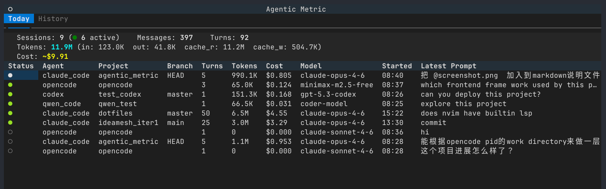

# Agentic Metric

[English](README.md)

本地化的 AI coding agent 指标监控工具 — 类似 `top`，但监控的是你的 coding agent。追踪 Claude Code、Codex、OpenCode、Qwen Code、VS Code (Copilot Chat) 等 agent 的 token 用量和成本，提供 TUI 仪表盘和 CLI 命令。

**支持平台：Linux 和 macOS。**

**所有数据完全存储在本地，使用过程不会联网。** 工具仅读取本机的 agent 数据文件（如 `~/.claude/`）和进程信息，不发送任何数据到外部服务器。



## 功能

- **实时监控** — 检测运行中的 agent 进程，增量解析 JSONL 会话数据
- **成本估算** — 基于各模型定价表计算 API 等效成本，支持 CLI 管理定价
- **今日概览** — 当天的 session 数、token 用量、花费汇总
- **历史趋势** — 每日 token/成本的 30 天趋势
- **TUI 仪表盘** — 终端图形界面，实时刷新（1 秒），含 token 堆叠图和趋势折线图
- **多 Agent 支持** — 插件架构，已支持 Claude Code、Codex、OpenCode、Qwen Code、VS Code，可扩展

## 各 Agent 指标覆盖情况

| 字段 | Claude Code | Codex | VS Code (Copilot) | OpenCode | Qwen Code |
|------|:-----------:|:-----:|:-----------------:|:--------:|:---------:|
| 会话 ID | ✓ | ✓ | ✓ | ✓ | ✓ |
| 项目路径 | ✓ | ✓ | ✓ | ✓ | ✓ |
| Git 分支 | ✓ | ✓ | ✗ | ✗ | ✓ |
| 模型名称 | ✓ | ✓ | ✓ | ✓ | ✓ |
| Input tokens | ✓ | ✓ | ✓¹ | ✓ | ✓ |
| Output tokens | ✓ | ✓ | ✓¹ | ✓ | ✓ |
| Cache tokens | ✓ | ✓² | ✗ | ✓² | ✓² |
| 用户轮次 | ✓ | ✓ | ✓ | ✓ | ✓ |
| 消息总数 | ✓ | ✓ | ✓ | ✓ | ✓ |
| 首条/末条 prompt | ✓ | ✓ | ✓ | ✓ | ✓ |
| 成本估算 | ✓ | ✓ | ✓¹ | ✓ | ✓ |
| 实时活跃状态 | ✓ | ✓ | ✓³ | ✓ | ✓ |

> ¹ VS Code 旧版 JSON 格式会话（早期 Copilot 版本）不含 token 数据，仅新版 JSONL 格式可统计。
>
> ² 仅支持 cache read tokens，cache write 数据不暴露。
>
> ³ VS Code 仅支持进程级检测，无法匹配到具体的 Copilot Chat 会话。

## 安装

需要 Python 3.10+。

```bash
pip install agentic-metric
```

## 使用

```bash
agentic-metric                 # 启动 TUI 仪表盘（无参数时默认启动）
agentic-metric status          # 查看当前活跃的 agent
agentic-metric today           # 今日用量概览
agentic-metric history         # 历史趋势（默认 30 天）
agentic-metric history -d 7    # 最近 7 天
agentic-metric sync            # 强制同步数据到本地数据库
agentic-metric tui             # 启动 TUI 仪表盘
agentic-metric bar             # 单行摘要，用于状态栏集成
agentic-metric pricing         # 管理模型定价
```

### 定价管理

模型定价用于成本估算。常见模型已内置定价，你可以通过 CLI 添加新模型或覆盖现有价格 — 用户自定义定价存储在 `$DATA/agentic_metric/pricing.json`。

```bash
agentic-metric pricing list                                    # 查看所有模型定价
agentic-metric pricing set deepseek-r2 -i 0.5 -o 2.0          # 添加新模型
agentic-metric pricing set claude-opus-4-6 -i 4.0 -o 20.0 -cr 0.4 -cw 5.0  # 覆盖内置定价
agentic-metric pricing reset deepseek-r2                       # 恢复单个模型为内置默认
agentic-metric pricing reset --all                             # 恢复所有定价为默认
```

对于未知模型，会按模型族自动匹配定价（如 `claude-sonnet-*` 使用 Sonnet 定价），最后才使用全局默认值。

### 状态栏集成

`agentic-metric bar` 输出紧凑的单行摘要（如 `AM: $1.23 | 4.5M`），可嵌入 i3blocks、waybar、tmux、vim statusline 等状态栏。

**i3blocks / waybar：**

```ini
[agentic-metric]
command=agentic-metric bar
interval=60
```

**tmux：**

```tmux
set -g status-right '#(agentic-metric bar | head -1)'
set -g status-interval 60    # 每 60 秒刷新一次（默认 15 秒）
```

**vim / neovim statusline：**

```vim
set statusline+=%{system('agentic-metric\ bar\ \|\ head\ -1')}
" statusline 在光标移动、模式切换等事件时自动刷新
" 如需定时刷新，可添加 timer：
autocmd CursorHold * redrawstatus
set updatetime=60000          " 空闲 60 秒后触发 CursorHold
```

### TUI 快捷键

| 键 | 功能 |
|----|------|
| `q` | 退出 |
| `r` | 刷新数据 |
| `Tab` | 切换 Dashboard / History 标签页 |

## 数据来源

数据路径因平台而异，下表中 `$CONFIG` 和 `$DATA` 含义如下：

| | Linux | macOS |
|--|-------|-------|
| `$CONFIG` | `~/.config` | `~/Library/Application Support` |
| `$DATA` | `~/.local/share` | `~/Library/Application Support` |

| Agent | 数据路径 | 采集内容 |
|-------|---------|---------|
| Claude Code | `~/.claude/projects/` | JSONL 会话、token 用量、模型、分支 |
| Claude Code | `~/.claude/stats-cache.json` | 每日活动统计 |
| Codex | `~/.codex/sessions/` | JSONL 会话、token 用量、模型 |
| VS Code | `$CONFIG/Code/User/workspaceStorage/*/chatSessions/` | 聊天会话（JSON + JSONL）、token 用量（仅 JSONL）、模型 |
| VS Code | `$CONFIG/Code/User/globalStorage/emptyWindowChatSessions/` | 未打开项目时的聊天会话 |
| VS Code | 进程检测 | 运行状态、工作目录 |
| OpenCode | `$DATA/opencode/opencode.db` | SQLite 会话、消息、token 用量、模型 |
| OpenCode | 进程检测 | 运行状态、活跃会话匹配 |
| Qwen Code | `~/.qwen/projects/*/chats/` | JSONL 会话、token 用量、模型、分支 |
| Qwen Code | 进程检测 | 运行状态、工作目录 |

所有数据汇总存储在 `$DATA/agentic_metric/data.db`（SQLite）。

## 不支持的 Agent

- **Cursor** — Cursor 自 2026 年 1 月左右（约 2.0.63+ 版本）起不再向本地 `state.vscdb` 数据库写入 token 用量数据（`tokenCount`），所有 `inputTokens`/`outputTokens` 值均为 0。Cursor 已将用量追踪迁移至服务端。由于本工具的设计原则是完全离线、不联网，无法通过网络 API 获取 Cursor 的用量数据，因此无法支持监测 Cursor 的用量。

## 隐私

- 不联网，不发送任何数据
- 不修改 agent 的配置或数据文件（只读）
- 所有统计数据存储在本地 SQLite 数据库
- 可随时删除数据目录清除所有数据（Linux: `~/.local/share/agentic_metric/`，macOS: `~/Library/Application Support/agentic_metric/`）
