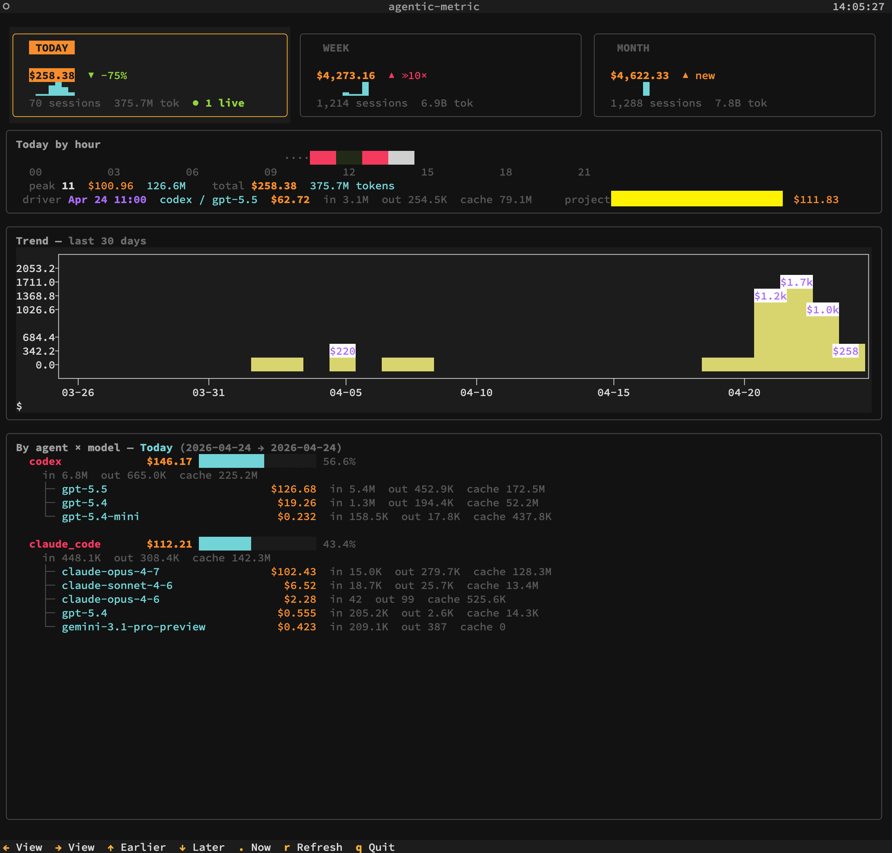

# Agentic Metric X

[](https://pypi.org/project/agentic-metric-x/)
[](https://pypi.org/project/agentic-metric-x/)

[English](README.md)

本地化的 AI coding agent 指标监控工具 — 类似 `top`,但监控的是你的 coding agent。追踪 **Claude Code** 和 **Codex** 的 token 用量和成本,提供 TUI 仪表盘和 CLI 命令。

**支持平台:Linux、macOS 和 Windows。**

**所有数据完全存储在本地,使用过程不会联网。** 工具仅读取本机的 agent 数据文件(`~/.claude/`、`~/.codex/`)和进程信息,不发送任何数据到外部服务器。



## 功能

- **实时监控** — 检测运行中的 agent 进程,增量解析 JSONL 会话数据
- **成本估算** — 基于各模型定价表计算 API 等效成本,支持 CLI 管理定价;支持长上下文和缓存时长定价
- **统一的用量报告** — 单个 `report` 命令覆盖今日 / 本周 / 本月 / 自定义区间,含 agent × model 明细、项目排行、会话排行、小时/天/周热图
- **TUI 仪表盘** — 终端图形界面,实时刷新,含汇总卡片、热图条、30 天成本柱图、agent × model 分解
- **多 Agent 支持** — 插件架构;目前支持 Claude Code 和 Codex,可扩展

## 各 Agent 指标覆盖情况

| 字段 | Claude Code | Codex |
|------|:-----------:|:-----:|
| 会话 ID | ✓ | ✓ |
| 项目路径 | ✓ | ✓ |
| Git 分支 | ✓ | ✓ |
| 模型名称 | ✓ | ✓ |
| Input tokens | ✓ | ✓ |
| Output tokens | ✓ | ✓ |
| Cache tokens | ✓ | ✓¹ |
| 用户轮次 | ✓ | ✓ |
| 消息总数 | ✓ | ✓ |
| 首条/末条 prompt | ✓ | ✓ |
| 成本估算 | ✓ | ✓ |
| 实时活跃状态 | ✓ | ✓ |

> ¹ Codex 仅暴露 cache-read tokens,cache-write 不上报。OpenAI 的 `input_tokens`
> 字段本身包含了已缓存部分,collector 存储时会扣掉 `cached_input_tokens`,
> 避免在 input 价和 cache-read 价上重复计费。

## 安装

需要 Python 3.10+。

```bash
pip install agentic-metric-x
```

或使用 [uv](https://docs.astral.sh/uv/):

```bash
uvx agentic-metric-x              # 直接运行,无需安装
uv tool install agentic-metric-x   # 持久安装
uv tool upgrade agentic-metric-x   # 升级到最新版
```

## 使用

```bash
agentic-metric                       # 启动 TUI 仪表盘(无参数时默认启动)
agentic-metric tui                   # 显式启动 TUI 仪表盘
agentic-metric sync                  # 强制同步各 collector 到本地数据库
agentic-metric report --today        # 今日用量报告
agentic-metric report --week         # 本周(周一至今)
agentic-metric report --month        # 本月
agentic-metric report --range 2026-04-01:2026-04-23   # 自定义日期区间
agentic-metric today                 # `report --today` 的快捷方式
agentic-metric week                  # `report --week` 的快捷方式
agentic-metric month                 # `report --month` 的快捷方式
agentic-metric history -d 30         # 最近 N 天(默认 14 天)
agentic-metric pricing               # 管理模型定价
```

### Report 选项

| 选项 | 说明 |
|------|------|
| `--today` | 今日用量 |
| `--week` | 本周用量(周一至今) |
| `--month` | 本月用量 |
| `--range FROM:TO` | 自定义日期区间,如 `2026-04-01:2026-04-23` |
| `--full` | 显示更多明细表(agent × model、时间粒度分解) |
| `--limit N` / `-n N` | 明细表行数(1–25,默认 8) |
| `--no-sync` | 跳过查询前的 collector 同步 |

`report` 会输出:总成本 / sessions / 用户轮次 / tokens / 缓存命中率的汇总条,
与上一同类周期的差额,一个热图条(`--today` 按小时、`--week` 按日、`--month`
按周),以及 agent × model、项目、会话、时间桶的明细表。

### 定价管理

模型定价用于成本估算。常见模型已内置定价,你可以通过 CLI 添加新模型、覆盖现有价格、
配置长上下文费率和缓存时长费率。用户自定义定价存储在 `$DATA/agentic_metric/pricing.json`。

#### 基础模型定价

```bash
agentic-metric pricing list                                                # 查看所有模型定价
agentic-metric pricing set deepseek-r2 -i 0.5 -o 2.0                       # 添加新模型
agentic-metric pricing set claude-opus-4-7 -i 4.0 -o 20.0 -cr 0.4 -cw 5.0  # 覆盖内置定价
agentic-metric pricing reset deepseek-r2                                   # 恢复单个模型为内置默认
agentic-metric pricing reset --all                                         # 恢复所有定价为默认
```

#### 长上下文定价

某些模型在单次请求超过 token 阈值时会使用更高的费率。工具在 collector 提供事件级用量时按事件应用这些费率。

```bash
agentic-metric pricing long-context set gpt-5.5 --threshold 272000 -i 10 -o 45 -cr 1 -cw 0
agentic-metric pricing long-context reset gpt-5.5        # 删除用户覆盖
agentic-metric pricing long-context disable gpt-5.5      # 禁用内置规则
agentic-metric pricing long-context enable gpt-5.5       # 重新启用内置规则
```

#### 缓存时长定价

Anthropic 对不同 TTL 的 cache write 收取不同费率。工具默认使用 5 分钟费率;如需 1 小时缓存时长,可手动覆盖。

```bash
agentic-metric pricing cache set claude-sonnet-4 --write-1h 6    # 设置 1 小时 cache write 价格
agentic-metric pricing cache reset claude-sonnet-4                # 删除覆盖
```

未知模型不会自动套用默认价或模型族价格。界面会显示为 `Unknown`,费用显示为 `?`,直到你用 `agentic-metric pricing set` 添加明确价格。

定价变更后,命令会自动重新同步历史数据,从原始 JSONL 数据重新计算事件级成本(如长上下文请求)。

### TUI 快捷键

| 键 | 功能 |
|----|------|
| `←` / `→` | 切换视图(Today / Week / Month) |
| `↑` / `↓` | 时间范围往前 / 往后 |
| `.` | 回到"现在"(清空 offset) |
| `t` / `w` / `m` | 直接聚焦 Today / Week / Month |
| `r` | 刷新数据 |
| `q` | 退出 |

## 内置模型定价

价格为 USD / 1M tokens。数据来源为官方定价页面(2026-04-25 核实)。

<details>
<summary>Anthropic Claude</summary>

| 模型 | Input | Output | Cache Read | Cache Write |
|------|------:|-------:|-----------:|------------:|
| claude-opus-4-7 / 4-6 / 4-5 | $5.00 | $25.00 | $0.50 | $6.25 |
| claude-opus-4-1 / 4 | $15.00 | $75.00 | $1.50 | $18.75 |
| claude-sonnet-4-6 / 4-5 / 4 / 3-7 | $3.00 | $15.00 | $0.30 | $3.75 |
| claude-haiku-4-5 | $1.00 | $5.00 | $0.10 | $1.25 |
| claude-haiku-3-5 | $0.80 | $4.00 | $0.08 | $1.00 |

</details>

<details>
<summary>OpenAI GPT</summary>

| 模型 | Input | Output | Cache Read | Cache Write |
|------|------:|-------:|-----------:|------------:|
| gpt-5.5 | $5.00 | $30.00 | $0.50 | — |
| gpt-5.4 | $2.50 | $15.00 | $0.25 | — |
| gpt-5.4-mini | $0.75 | $4.50 | $0.075 | — |
| gpt-5.4-nano | $0.20 | $1.25 | $0.02 | — |
| gpt-5.3 / 5.2 / 5.1 / 5 | $1.25–$1.75 | $10.00–$14.00 | $0.125–$0.175 | — |

</details>

<details>
<summary>Google Gemini</summary>

| 模型 | Input | Output | Cache Read | Cache Write |
|------|------:|-------:|-----------:|------------:|
| gemini-3.1-pro / 3-pro | $2.00 | $12.00 | $0.20 | — |
| gemini-3-flash | $0.50 | $3.00 | $0.05 | — |
| gemini-2.5-pro | $1.25 | $10.00 | $0.125 | — |
| gemini-2.5-flash | $0.30 | $2.50 | $0.03 | — |

</details>

<details>
<summary>其他</summary>

| 模型 | Input | Output | Cache Read | Cache Write |
|------|------:|-------:|-----------:|------------:|
| kimi-k2.6 | $0.95 | $4.00 | $0.16 | — |
| glm-5.1 | $0.95 | $3.15 | $0.10 | — |

</details>

运行 `agentic-metric pricing list` 查看完整定价表(包含你的覆盖配置)。

## 架构

```
src/agentic_metric/
├── cli.py              # Typer CLI 命令和 Rich 报告渲染
├── config.py           # 平台路径、环境变量、常量
├── models.py           # 数据类(LiveSession, TodayOverview, DailyTrend)
├── pricing.py          # 内置 + 用户定价,成本估算引擎
├── collectors/
│   ├── __init__.py     # Collector 注册中心和基类
│   ├── claude_code.py  # Claude Code JSONL 解析器和进程检测
│   ├── codex.py        # Codex JSONL 解析器和进程检测
│   └── _process.py     # 跨平台进程检测(psutil / tasklist)
├── store/
│   ├── __init__.py
│   ├── database.py     # SQLite 数据库(sessions, session_usage 分桶表)
│   └── aggregator.py   # 查询层:区间汇总、热图、多维分解
└── tui/
    ├── __init__.py
    ├── app.py          # Textual TUI 应用
    └── widgets.py      # 自定义 TUI 组件
```

### 数据流

1. **Collectors** 读取 agent 数据文件(`~/.claude/`、`~/.codex/`),产出 `LiveSession` 对象。
2. **Database** 将 sessions 和按日拆分的 `session_usage` 桶存入 SQLite。
3. **Aggregator** 执行 SQL 查询生成报告(区间汇总、热图、agent/model/project 分解)。
4. **CLI** 使用 Rich 渲染表格和面板。**TUI** 使用 Textual 提供实时仪表盘。
5. **Pricing** 引擎按事件计算成本(支持长上下文)或按会话汇总计算。

## 数据来源

数据路径因平台而异,下表中 `$DATA` 含义如下:

| | Linux | macOS | Windows |
|--|-------|-------|---------|
| `$DATA` | `~/.local/share` | `~/Library/Application Support` | `%LOCALAPPDATA%` |

| Agent | 数据路径 | 采集内容 |
|-------|---------|---------|
| Claude Code | `~/.claude/projects/` | JSONL 会话、token 用量、模型、分支 |
| Claude Code | `~/.claude/stats-cache.json` | 每日活动统计 |
| Claude Code | 进程检测 | 运行状态、工作目录 |
| Codex | `~/.codex/sessions/` | JSONL 会话、token 用量、模型 |
| Codex | 进程检测 | 运行状态、工作目录 |

Claude Code 支持 `CLAUDE_CONFIG_DIR`,Codex 支持 `CODEX_HOME`,如果你改了
这两个 agent 的配置目录,collector 会自动读取环境变量。

所有数据汇总存储在 `$DATA/agentic_metric/data.db`(SQLite)。

## 不支持的 Agent

- **Cursor** — Cursor 自 2026 年 1 月左右(约 2.0.63+ 版本)起不再向本地 `state.vscdb` 数据库写入 token 用量数据(`tokenCount`),所有 `inputTokens`/`outputTokens` 值均为 0。Cursor 已将用量追踪迁移至服务端。由于本工具的设计原则是完全离线、不联网,无法通过网络 API 获取 Cursor 的用量数据,因此无法支持监测 Cursor 的用量。
- **OpenCode / Qwen Code / VS Code Copilot Chat** — 这三个 collector 在
  v0.1.8 之前存在,v0.2.0 起因本 fork 聚焦 Claude Code + Codex 而移除。
  如果你仍需要这些 agent 的统计,请使用上游的 v0.1.8。

## 隐私

- 不联网,不发送任何数据
- 不修改 agent 的配置或数据文件(只读)
- 所有统计数据存储在本地 SQLite 数据库
- 可随时删除数据目录清除所有数据(Linux: `~/.local/share/agentic_metric/`,macOS: `~/Library/Application Support/agentic_metric/`,Windows: `%LOCALAPPDATA%\agentic_metric\`)

## 开发

```bash
git clone https://github.com/xihuai18/agentic-metric
cd agentic-metric
pip install -e ".[dev]"
pytest
```

## 许可证

MIT — 详见 [LICENSE](LICENSE)。

Fork 自 [MrQianjinsi/agentic-metric](https://github.com/MrQianjinsi/agentic-metric)(基于上游 v0.1.8)。本 fork 相对上游的变更见 [CHANGELOG.md](CHANGELOG.md)。
