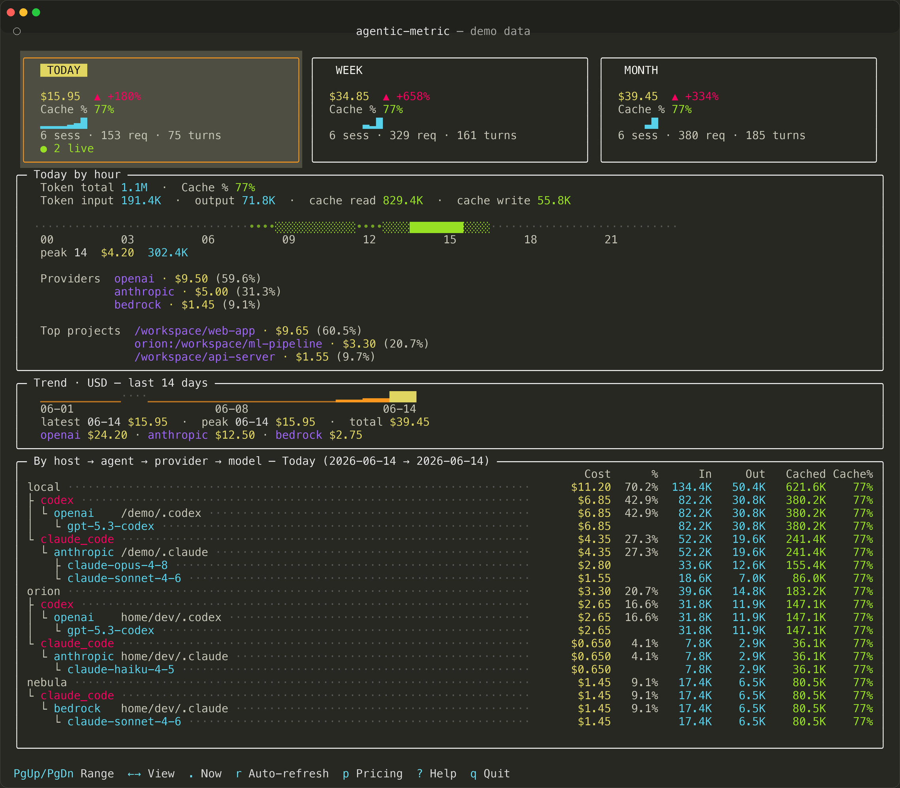

# Agentic Metric X

[](https://pypi.org/project/agentic-metric-x/)
[](https://pypi.org/project/agentic-metric-x/)

[中文文档](README-CN.md)

A local-only monitoring tool for AI coding agents — like `top`, but for your coding agents. Track token usage and costs across **Claude Code** and **Codex** — with a TUI dashboard and CLI.

**Supported platforms: Linux, macOS, and Windows.**

**All data stays under your control. No telemetry is sent anywhere.** By default
the tool only reads local agent data files (`~/.claude/`, `~/.codex/`) and
process info. If SSH remotes are configured, it reads those remote agent data
files over SSH and caches a local copy for aggregation.



## Features

- **Live monitoring** — Detect running agent processes, incremental JSONL session parsing
- **Cost estimation** — Per-model pricing table with CLI management, calculates API-equivalent costs; supports long-context and cache-duration pricing
- **Unified report** — One `report` command for today / week / month / custom date range, with agent × provider × model breakdown, top projects, cost drivers, and hourly/daily/weekly heatmaps
- **TUI dashboard** — Terminal UI with live refresh, stacked summary cells, heatmap strip, 30-day cost chart, and agent → provider → model breakdown
- **Multi-agent** — Plugin architecture; supports Claude Code and Codex today, extensible

## Agent Data Coverage

| Field | Claude Code | Codex |
|-------|:-----------:|:-----:|
| Session ID | ✓ | ✓ |
| Project path | ✓ | ✓ |
| Git branch | ✓ | ✓ |
| Model | ✓ | ✓ |
| Input tokens | ✓ | ✓ |
| Output tokens | ✓ | ✓ |
| Cache tokens | ✓ | ✓¹ |
| User turns | ✓ | ✓ |
| Message count | ✓ | ✓ |
| First/last prompt | ✓ | ✓ |
| Cost estimation | ✓ | ✓ |
| Live active status | ✓ | ✓ |

> ¹ Codex exposes cache-read tokens only; cache-write is not reported. Codex's
> `input_tokens` already includes cached tokens, so the collector stores
> `input_tokens − cached_input_tokens` to avoid double-charging at both input
> and cache-read pricing.

## Installation

Requires Python 3.10+.

```bash
pip install agentic-metric-x
```

Or with [uv](https://docs.astral.sh/uv/):

```bash
uvx agentic-metric-x              # Run directly without installing
uv tool install agentic-metric-x   # Or install persistently
uv tool upgrade agentic-metric-x   # Upgrade to latest version
```

## Usage

```bash
agentic-metric                       # Launch TUI dashboard (default when no command given)
agentic-metric tui                   # Launch TUI dashboard explicitly
agentic-metric sync                  # Force sync collectors to the local database
agentic-metric sync --rebuild        # Rebuild the derived database from source session logs
agentic-metric report --today        # Today's usage report
agentic-metric report --week         # This week (Mon → today)
agentic-metric report --month        # This month
agentic-metric report --range 2026-04-01:2026-04-23   # Custom date range
agentic-metric today                 # Shortcut for `report --today`
agentic-metric week                  # Shortcut for `report --week`
agentic-metric month                 # Shortcut for `report --month`
agentic-metric history -d 30         # Last N days (default 14)
agentic-metric pricing               # Manage model pricing
```

### Report Options

| Option | Description |
|--------|-------------|
| `--today` | Today's usage |
| `--week` | This week (Mon → today) |
| `--month` | This month |
| `--range FROM:TO` | Custom date range, e.g. `2026-04-01:2026-04-23` |
| `--full` | Show extra drill-down tables (by agent, periodic breakdown) |
| `--limit N` / `-n N` | Rows in driver tables and per-provider model breakdown (1–25, default 8) |
| `--json` | Output machine-readable JSON instead of tables (for scripts / pipes) |
| `--watch N` / `-w N` | Refresh the report every N seconds (Ctrl-C to stop) |
| `--no-sync` | Skip syncing collectors before querying |

`report` shows a header with total cost / sessions / turns / tokens / cache-hit
rate, a delta vs. the previous equivalent period, a heatmap strip (hours for
`--today`, days for `--week`, weeks for `--month`), plus a default `agent × provider × model`
breakdown, top projects, top cost drivers, and optional extra drill-down tables.

### Pricing Management

Model pricing is used for cost estimation. Builtin pricing is included for
common models. You can add new models, override builtins, configure
long-context rates, and configure observable cache-duration rates via CLI.
Overrides are stored in `$DATA/agentic_metric/pricing.json`.

#### Basic model pricing

```bash
agentic-metric pricing list                                                # List all model pricing
agentic-metric pricing set deepseek-r2 -i 0.5 -o 2.0                       # Add a new model
agentic-metric pricing set claude-opus-4-7 -i 4.0 -o 20.0 -cr 0.4 -cw 5.0  # Override builtin
agentic-metric pricing reset deepseek-r2                                   # Reset one model to builtin
agentic-metric pricing reset --all                                         # Reset all overrides
```

#### Long-context pricing

Some models charge higher rates when a single request exceeds a token
threshold. The tool applies these rates per-event when collectors provide
event-level usage.

```bash
agentic-metric pricing long-context set gpt-5.5 --threshold 272000 -i 10 -o 45 -cr 1 -cw 0
agentic-metric pricing long-context reset gpt-5.5        # Remove user override
agentic-metric pricing long-context disable gpt-5.5      # Disable builtin rule
agentic-metric pricing long-context enable gpt-5.5       # Re-enable builtin rule
```

#### Cache-duration pricing

Anthropic charges different cache-write prices depending on cache TTL.
By default the tool uses the 5-minute rate; override for 1-hour cache
duration when applicable.

```bash
agentic-metric pricing cache set claude-sonnet-4 --write-1h 6    # Set 1h cache write price
agentic-metric pricing cache reset claude-sonnet-4                # Remove override
```

Unknown models are not priced by default. They are displayed as `Unknown` with
cost `?` until you add explicit pricing with `agentic-metric pricing set`.
Provider speed/priority modes are not shown or priced separately because the
local history files do not expose reliable non-standard markers.

After a pricing change, the command resyncs local history so event-level costs
such as long-context requests are recalculated from the original JSONL data.

If cached history ever looks stale after changing roots/providers, run
`agentic-metric sync --rebuild`. This deletes only this tool's derived SQLite
database and rebuilds it from the original Claude Code and Codex session files;
`config.json`, `pricing.json`, and agent data directories are left untouched.

### TUI Keybindings

Shown in the footer as: `←→ View · ↑↓ Range · . Now · r Sync · R Live · p Pricing · q Quit`.

| Key | Footer | Action |
|-----|--------|--------|
| `←` / `→` (or `h` / `l`) | View | Switch view (Today / Week / Month) |
| `↑` / `↓` (or `k` / `j`) | Range | Move time range earlier / later |
| `.` | Now | Jump back to "now" (reset offset) |
| `t` / `w` / `m` | — | Focus Today / Week / Month directly |
| `r` | Sync | Sync now (data already auto-syncs every 5 min by default) |
| `R` | Live | Toggle fast "live" sync; pauses the slow periodic sync while active |
| `p` | Pricing | Open the read-only pricing view (flags unknown models in range) |
| `q` | Quit | Quit |

Refresh intervals can be overridden in the config file (`$DATA/agentic_metric/config.json`):

```json
{ "intervals": { "live_refresh": 1, "data_sync": 300, "auto_refresh": 30 } }
```

## Builtin Model Pricing

Prices are USD per 1M tokens. Verified against official pricing docs
(2026-04-25; Claude Opus 4.8 on 2026-06-02).

<details>
<summary>Anthropic Claude</summary>

| Model | Input | Output | Cache Read | Cache Write |
|-------|------:|-------:|-----------:|------------:|
| claude-opus-4-8 / 4-7 / 4-6 / 4-5 | $5.00 | $25.00 | $0.50 | $6.25 |
| claude-opus-4-1 / 4 | $15.00 | $75.00 | $1.50 | $18.75 |
| claude-sonnet-4-6 / 4-5 / 4 / 3-7 | $3.00 | $15.00 | $0.30 | $3.75 |
| claude-haiku-4-5 | $1.00 | $5.00 | $0.10 | $1.25 |
| claude-haiku-3-5 | $0.80 | $4.00 | $0.08 | $1.00 |

</details>

<details>
<summary>OpenAI GPT</summary>

| Model | Input | Output | Cache Read | Cache Write |
|-------|------:|-------:|-----------:|------------:|
| gpt-5.5 | $5.00 | $30.00 | $0.50 | — |
| gpt-5.4 | $2.50 | $15.00 | $0.25 | — |
| gpt-5.4-mini | $0.75 | $4.50 | $0.075 | — |
| gpt-5.4-nano | $0.20 | $1.25 | $0.02 | — |
| gpt-5.3 / 5.2 / 5.1 / 5 | $1.25–$1.75 | $10.00–$14.00 | $0.125–$0.175 | — |

</details>

<details>
<summary>Google Gemini</summary>

| Model | Input | Output | Cache Read | Cache Write |
|-------|------:|-------:|-----------:|------------:|
| gemini-3.1-pro / 3-pro | $2.00 | $12.00 | $0.20 | — |
| gemini-3-flash | $0.50 | $3.00 | $0.05 | — |
| gemini-2.5-flash | $0.30 | $2.50 | $0.03 | — |

</details>

Run `agentic-metric pricing list` for the full table including your overrides.

## Architecture

```
src/agentic_metric/
├── cli.py              # Typer CLI commands and Rich report rendering
├── config.py           # Platform paths, environment variables, constants
├── models.py           # Data classes (LiveSession, TodayOverview, DailyTrend)
├── pricing.py          # Builtin + user pricing, cost estimation engine
├── collectors/
│   ├── __init__.py     # Collector registry and base class
│   ├── claude_code.py  # Claude Code JSONL parser and process detector
│   ├── codex.py        # Codex JSONL parser and process detector
│   └── _process.py     # Cross-platform process detection (psutil/tasklist)
├── store/
│   ├── __init__.py
│   ├── database.py     # SQLite database (sessions, session_usage buckets)
│   └── aggregator.py   # Query layer: range totals, heatmaps, breakdowns
└── tui/
    ├── __init__.py
    ├── app.py          # Textual TUI application
    └── widgets.py      # Custom TUI widgets
```

### Data flow

1. **Collectors** read agent data files (`~/.claude/`, `~/.codex/`) and emit `LiveSession` objects.
2. **Database** stores sessions and per-day `session_usage` buckets in SQLite.
3. **Aggregator** runs SQL queries for reports (range totals, heatmaps, breakdowns by agent/model/project).
4. **CLI** renders Rich tables and panels. **TUI** uses Textual for a live dashboard.
5. **Pricing** engine calculates costs per-event (long-context aware) or per-session.

## Data Sources

Paths differ by platform. `$DATA` refers to:

| | Linux | macOS | Windows |
|--|-------|-------|---------|
| `$DATA` | `~/.local/share` | `~/Library/Application Support` | `%LOCALAPPDATA%` |

| Agent | Path | Data |
|-------|------|------|
| Claude Code | `~/.claude/projects/` | JSONL sessions, token usage, model, branch |
| Claude Code | `~/.claude/stats-cache.json` | Daily activity stats |
| Claude Code | Process detection | Running status, working directory |
| Codex | `~/.codex/sessions/` | JSONL sessions, token usage, model |
| Codex | Process detection | Running status, working directory |

By default, Claude Code honors `CLAUDE_CONFIG_DIR` and Codex honors
`CODEX_HOME`. To scan multiple roots, assign a provider explicitly, or include
SSH remotes, create this tool's own config file:

```json
{
  "collectors": {
    "codex": {
      "roots": [
        {"path": "~/.codex", "provider": "openai"},
        {"path": "~/.codex-custom", "provider": "custom"}
      ]
    },
    "claude_code": {
      "roots": [
        {"path": "~/.claude"},
        {"path": "~/.claude-alt"},
        {"path": "~/.claude-provider-b", "provider": "provider-b"}
      ]
    }
  },
  "remotes": [
    {
      "name": "devcloud",
      "host": "devcloud",
      "collectors": {
        "codex": {
          "roots": [{"path": "~/.codex", "provider": "openai"}]
        },
        "claude_code": {
          "roots": [{"path": "~/.claude"}]
        }
      }
    }
  ]
}
```

The default config path is `$DATA/agentic_metric/config.json`; set
`AGENTIC_METRIC_CONFIG` to point at another JSON file. Claude Code roots
without a provider are not guessed; Codex roots without a provider can still
fall back to the JSONL `model_provider`.

Remote entries use your existing `ssh` config. `host` may be an SSH alias or a
hostname; optional fields are `name`, `user`, `port`, `timeout`, and
`ssh_options`. If a remote does not configure collector roots, it reuses the
local collector root configuration; with no local config that means `~/.claude`
and `~/.codex` on the remote. Remote sync expands `~` on the remote host, reads
`projects/` and `sessions/` over SSH, stores a cache under
`$DATA/agentic_metric/remote-cache/`, and aggregates those rows with local usage.
It also keeps a remote file manifest in the cache, so repeated syncs only
download changed session/index files instead of transferring full agent
directories again. Cached files that disappear from the remote manifest are
moved under `.stale/` and no longer parsed.
If a remote path is missing, that collector is skipped rather than reusing old
cache contents. CLI/TUI totals stay merged, while breakdowns and top projects
retain the host/source dimension.

Reports keep the headline totals merged across local and remote data. Detail
tables use a compact `Source` label: local rows show the root (`~/.codex`), and
remote rows show `host:root` (`devcloud:~/.codex`). Top projects use the same
prefix for remote paths (`devcloud:/data/workspace/project`) so matching local
and remote project paths are never silently merged. `--full` adds a provider
rollup by source; the default report keeps the source × agent × provider × model
breakdown plus top projects.

All aggregated data is stored locally in `$DATA/agentic_metric/data.db` (SQLite).

## Unsupported Agents

- **Cursor** — Cursor stopped writing token usage data (`tokenCount`) to its local `state.vscdb` database around January 2026 (approximately version 2.0.63+). All `inputTokens`/`outputTokens` values are now zero. Cursor has moved usage tracking to a server-side system. Since this tool is designed to be fully offline with no network requests, monitoring Cursor usage is not supported.
- **OpenCode / Qwen Code / VS Code Copilot Chat** — collectors for these
  agents existed up to v0.1.8 and were removed in v0.2.0 as this fork narrowed
  its focus to Claude Code and Codex. If you need them, stay on v0.1.8 from
  upstream.

## Privacy

- **Local by default** — no network requests unless SSH remotes are configured
- **Read-only** — never modifies agent config or data files
- All stats stored in a local SQLite database
- Delete the data directory at any time to remove all data (`~/.local/share/agentic_metric/` on Linux, `~/Library/Application Support/agentic_metric/` on macOS, `%LOCALAPPDATA%\agentic_metric\` on Windows)

## Development

```bash
git clone https://github.com/xihuai18/agentic-metric
cd agentic-metric
pip install -e ".[dev]"
pytest
```

## License

MIT — see [LICENSE](LICENSE).

Forked from [MrQianjinsi/agentic-metric](https://github.com/MrQianjinsi/agentic-metric) (v0.1.8 upstream). See [CHANGELOG.md](CHANGELOG.md) for what changed in this fork.
